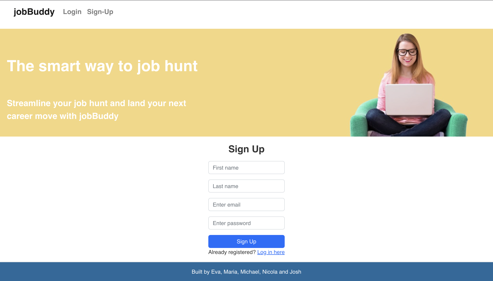

# jobBuddy

## About this project

With a Myriad of job sites to juggle, opportunities to manage and an ever changing list of applications to write and interviews to prepare for, its easy to get lost in all the noise of the job hunt.

In steps jobBuddy. Our user friendly job hunting app, helps job hunters stay organized and in control of every step of their job search journey.

This is an app built by a team of final junior software developers over the course of two weeks as a final project for the Makers Academy Software Engineering program.The platform was constructed utilizing the MERN (MongoDB, Express, React, and Node.js) technology stack. Jest was used to test the backend and cypress was used to test the frontend.


## Features
* User sign up
* Secure user log in / log out with JWT and Bcrypt
* Create a new job application / view a kanban board of ongoing job applications
* Drag job applications across the kanban board as they progress
* Edit and update job applications within a card editor
* Delete applications

## Project Learnings 

Through creating this app in a group environment, I improved my ability to:
- Build fullstack web applications using the MERN stack
- Create a MongoDB database and implement routes that interact with and manipulate data in these databases
- Integrate external components and libraries into my projects and iterate upon them
- Work and communicate effectively within a software development team
- Break down projects into tasks and assign them to pairs
- Use agile ceremonies to organise work into sprints and improve processes
- Use a developer workflow to plan, implement and peer-review features


#### Project setup

1. Clone this repository to your local machine
2. Install Node.js dependencies for both FE and BE (API)
   ```
   ; cd api
   ; npm install
   ; cd ../frontend
   ; npm install
   ```
3. Install an ESLint plugin for your editor.
4. Install MongoDB
   ```
   brew tap mongodb/brew
   brew install mongodb-community@5.0
   ```
   *Note:* If you see a message that says `If you need to have mongodb-community@5.0 first in your PATH, run:`, follow the instruction. Restart your terminal after this.
5. Start MongoDB
   ```
   brew services start mongodb-community@5.0
   ```
   
 #### Start

1. Start the back end server

   ```
   ; cd api
   ; npm start
   ```
2. Start the front end

  In a new terminal session...

  ```
  ; cd frontend
  ; npm start
  ```
  
  #### Testing


#### The Backend (API)

**Note the use of an environment variable for the JWT secret**

  Start the server in test mode (so that it connects to the test DB)

  ```
  ; cd api
  ; JWT_SECRET=SUPER_SECRET npm run start:test
  ```

  Then run the tests in a new terminal session

  ```
  ; cd api
  ; JWT_SECRET=SUPER_SECRET npm run test
  ```

#### The frontend (React)

**Note the use of an environment variable for the JWT secret**

  Start the server in test mode (so that it connects to the test DB)

  ```
  ; cd api
  ; npm run start:test
  ```

  Then start the front end in a new terminal session

  ```
  ; cd frontend
  ;  npm start
  ```

  Then run the tests in a new terminal session

  ```
  ; cd frontend
  ;  npm run test
  ```
  
## Screenshots

#### Sign Up

#### Friends Page

#### Friend Profile

#### Friend Request Recieved

#### Friend Request Sent

#### Own profile

#### Post with comment

#### Hover over like button to see post likers


